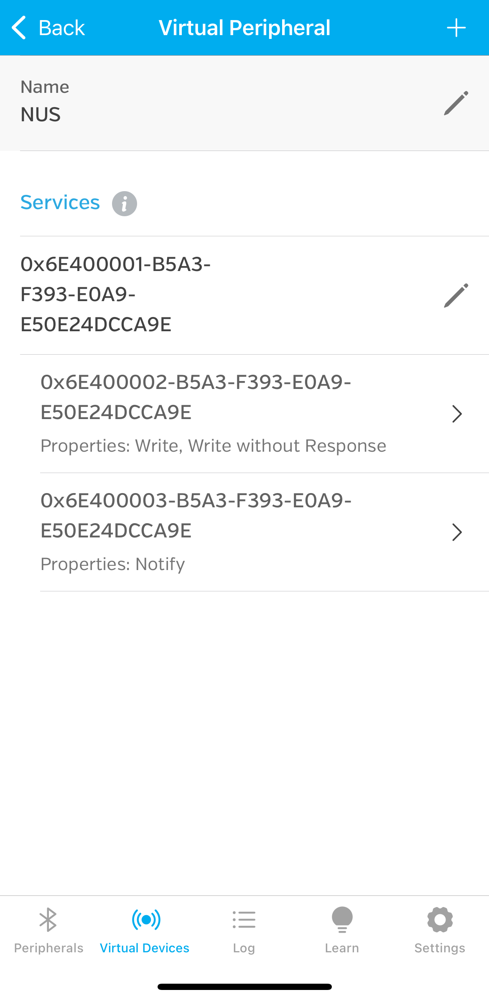

# X5 BLE Demo

这是一个基于GattLib的BLE（蓝牙低功耗）示例程序，实现了与NUS（Nordic UART Service）设备的通信功能。

建议可以使用 iPhone 的 LightBlue app 进行辅助调试，app 上配置如下:



这些 UUID 可直接从 [src/ble_min.c](src/ble_min.c) 复制

## 功能特点

- 扫描BLE设备
- 连接到 NUS 服务设备
- 发送数据到设备（RX特性）
- 接收来自设备的通知（TX特性）

## 编译和运行

### 使用VSCode Dev Container（推荐）

该项目配置了VSCode Dev Container，这是推荐的开发和调试方式。Dev Container提供了一个预配置的开发环境，包含了所有必要的依赖项。

要使用Dev Container：

1. 在VSCode中打开项目
2. 如果系统提示"Reopen in Container"，请点击该选项
3. 如果没有提示，可以按`Ctrl+Shift+P`，然后选择"Dev Containers: Reopen in Container"

在Dev Container中，你可以直接编译和运行项目：

```bash
cd build
make
./bin/ble_min
```

### 使用Docker进行编译

如果你不想使用VSCode Dev Container，也可以使用Docker进行编译：

```bash
make build
```

这将生成可执行文件 `./out/ble_min`。

### 直接编译

如果你已经安装了所有依赖项，也可以直接使用CMake进行编译：

```bash
mkdir -p build
cd build
cmake ..
make
./bin/ble_min
```

### 运行

无论使用哪种编译方式，运行程序都需要sudo权限来访问蓝牙设备：

```bash
sudo ./bin/ble_min
```

或者在Docker编译的情况下：

```bash
sudo ./out/ble_min
```

## 常用使用方式

1. **扫描和连接设备**：
   程序会自动扫描周围的BLE设备，寻找提供NUS服务的设备。找到后会自动连接。

2. **发送数据**：
   连接成功后，程序会自动向设备的RX特性发送"hello"消息。

3. **接收通知**：
   程序会订阅TX特性的通知，并在收到数据时打印到控制台。

4. **断开连接**：
   在发送数据并等待一段时间后，程序会自动断开连接。

## 调试方法

1. **查看日志输出**：
   程序会在关键步骤打印日志信息，包括扫描、连接、发送和接收数据等。

2. **检查蓝牙适配器**：
   确保蓝牙适配器已启用并正常工作：
   ```bash
   hciconfig
   ```

3. **查看蓝牙设备**：
   使用`bluetoothctl`工具查看周围的蓝牙设备：
   ```bash
   bluetoothctl
   scan on
   ```

4. **检查权限**：
   确保运行程序的用户有权限访问蓝牙设备，通常需要sudo权限。

5. **调试编译问题**：
   如果编译失败，检查Docker镜像中的依赖库是否正确安装，特别是GattLib及其依赖项。

## 代码结构

- `src/ble_min.c`：主程序文件，实现了BLE设备扫描、连接、数据发送和接收功能。
- `CMakeLists.txt`：CMake配置文件，用于编译项目。
- `Dockerfile`：Docker配置文件，用于构建编译环境。
- `Makefile`：Make配置文件，简化编译和构建过程。

## 依赖项

- GattLib：用于访问 BLE 设备的 GATT 协议
- BlueZ：Linux 蓝牙协议栈
- GLib：C 语言的通用工具库